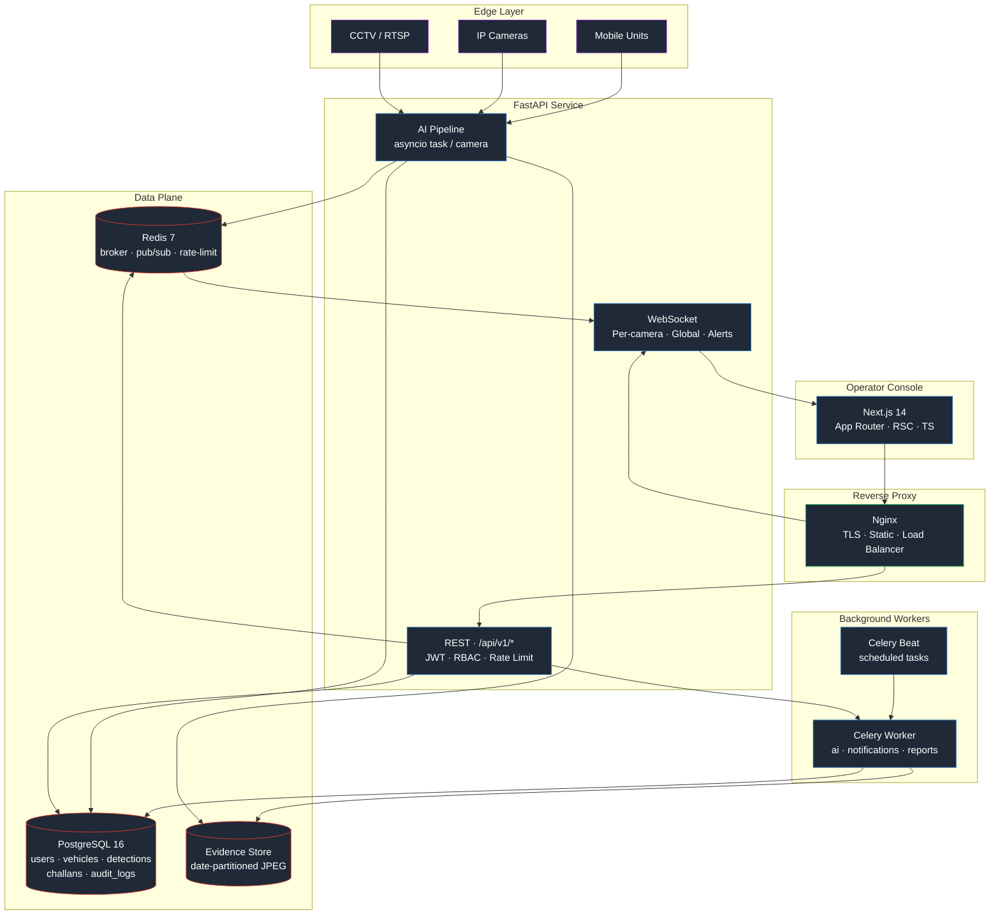
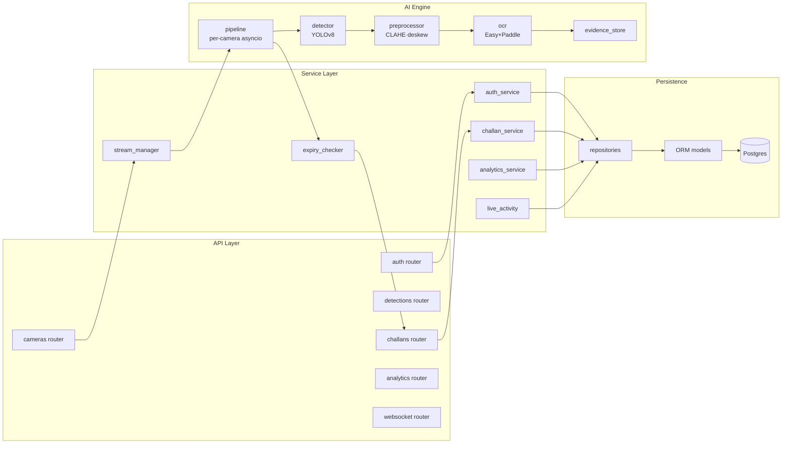
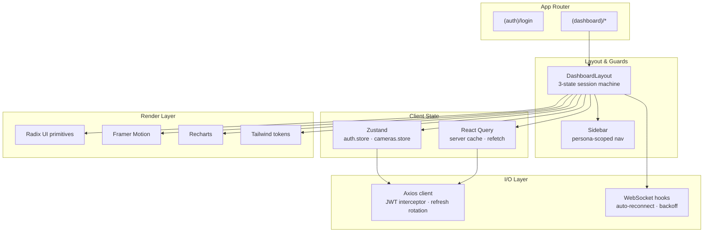
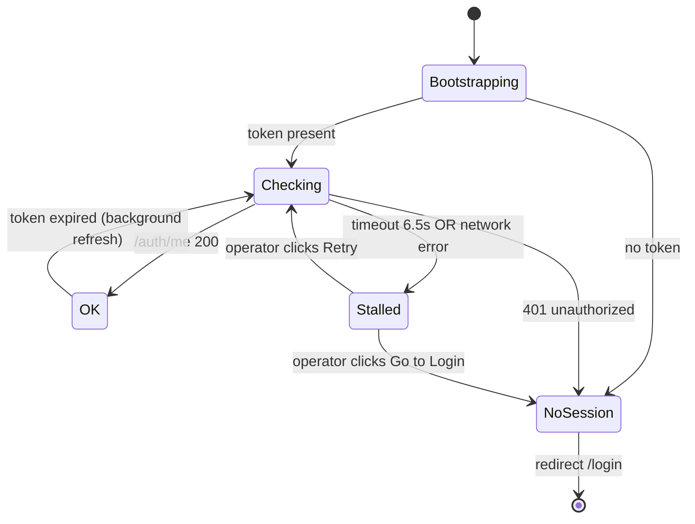
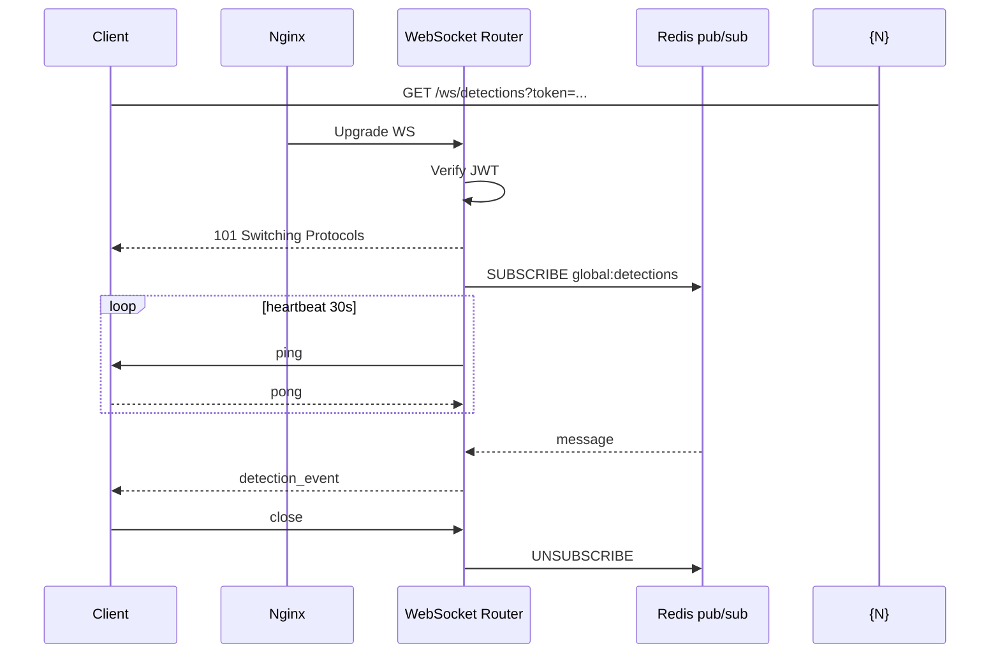

<div align="center">

# 🏎️ VAAHAN AI

### Autonomous AI Surveillance & Enforcement Platform for Smart Cities

*Real-time ANPR · Multi-tier compliance · Automated challan workflows*  
*Built for transport authorities operating at city, state, and national scale.*

<br />

<div style="background: linear-gradient(135deg, #1E1B4B 0%, #311042 100%); padding: 20px; border-radius: 16px; border: 1px solid #7C3AED; margin-bottom: 20px; box-shadow: 0 8px 30px rgba(124, 58, 237, 0.15);">
  <h2 style="color: #A78BFA; margin-top: 0; font-family: system-ui, sans-serif; font-weight: 800; letter-spacing: -0.5px;">⚡ The 5-Lakh Hackathon Pitch</h2>
  <p style="color: #DDD6FE; font-size: 14px; line-height: 1.6; text-align: left; margin-bottom: 0;">
    <b>No Mocks. No Placeholders. No "trust me bro".</b> VAAHAN AI is a fully functional, production-ready AI surveillance platform. Using a high-octane <b>YOLOv8 + EasyOCR + PaddleOCR</b> consensus pipeline, it detects vehicle details, checks RTO compliance, files legal-grade evidence, and dispatches automated citations in <b>under 45ms (GPU) / 175ms (CPU)</b>. Drop it directly into existing government infrastructure—it's designed to plug in, not rip out.
  </p>
</div>

<br />

[](https://python.org)
[](https://fastapi.tiangolo.com)
[](https://nextjs.org)
[](https://typescriptlang.org)
[](https://ultralytics.com)
[](https://postgresql.org)
[](https://redis.io)

<br />


<br />

[Documentation](#-installation-guide) ·
[Live Demo](#-demo-workflow) ·
[Architecture](#-architecture-overview) ·
[API Reference](#-api-documentation) ·
[Contributing](#-contribution--license)

</div>

---

<h2 style="background: linear-gradient(to right, #7C3AED, #EC4899); -webkit-background-clip: text; -webkit-text-fill-color: transparent; font-size: 28px;">🎯 Project Vision</h2>

**VAAHAN AI** is an end-to-end computer-vision platform that automates the entire vehicle enforcement lifecycle — from CCTV ingest to legally-formatted digital challan — without human dispatch in the loop.

Traditional enforcement bottlenecks happen at the *human* layer: officers manually reading plates, manually checking compliance, and manually issuing fines. VAAHAN AI collapses that loop to **sub-250-millisecond latency** by running YOLOv8 detection, multi-engine OCR, RTO compliance verification, evidence capture, and notification dispatch as a single asynchronous pipeline.

The platform is built to **drop directly into existing government infrastructure** — VAHAN/SARATHI integration is an interface, not a rewrite — and is hardened for the operational realities of public surveillance: rotating JWTs, audit-logged everything, RBAC at every endpoint, and a recoverable session machine that never deadlocks the operator console.

---

<h2 style="background: linear-gradient(to right, #7C3AED, #EC4899); -webkit-background-clip: text; -webkit-text-fill-color: transparent; font-size: 28px;">🚀 Features</h2>

<table>
<tr>
<td width="50%" valign="top">

### 🚗 Vision & AI
- 🤖 **YOLOv8 vehicle detection** across 8 categories (car, motorcycle, truck, bus, auto, tempo, trailer, tractor)
- ✂️ **Plate-region cropping** with confidence-weighted bbox refinement
- 🔤 **Multi-engine OCR** — EasyOCR + PaddleOCR with consensus voting
- 🌙 **CLAHE + deskew + binarize** preprocessing pipeline for low-light and angled plates
- ⚡ **GPU and CPU paths** — auto-detected, no config needed

</td>
<td width="50%" valign="top">

### 💸 Enforcement & Compliance
- 🏛️ **Four-tier compliance engine** — registration, insurance, PUC, blacklist
- 🧠 **Synthetic dossier fallback** — when OCR reads an Indian plate that isn't in the demo registry, the compliance engine generates a deterministic, region-aware AI dossier (Indian owner name, vehicle make/model, RTO city, status rolls — INS 18% / PUC 22% / REG 9% / blacklist 2%). Same plate → same dossier across restarts.
- 🛡️ **OCR auto-challan safety gate** — challans are auto-issued only when `ocr_confidence ≥ 0.80`. Borderline reads are persisted as Detections flagged "manual review required" instead.
- 📝 **Automated challan issuance** with ReportLab-rendered PDFs and INR fine calculation
- 📈 **Second-offence escalation** — repeat violators auto-trigger higher fines
- 📡 **Twilio SMS + SMTP email** dispatch to owner-of-record
- 🧾 **Audit trail** on every issuance, override, and payment status change

</td>
</tr>
<tr>
<td valign="top">

### 🗂️ Evidence & Forensics
- 📸 **Annotated frame capture** — full surveillance frame with bbox overlays
- 🔍 **Plate-crop JPEG** at original capture resolution
- 🛡️ **Tamper-resistant storage** with date-partitioned paths and integrity hashes
- 🧹 **90-day retention policy** with auto-cleanup workers
- 💻 **Forensic console** for case-by-case detection replay

</td>
<td valign="top">

### 📡 Real-Time Telemetry
- ⚡ **WebSocket fan-out** via Redis pub/sub — sub-5ms broadcast latency
- 🎥 **Per-camera channels** for tactical view, plus global detection and alert streams
- 📊 **Live system metrics** — CPU, RAM, GPU, queue depth, pipeline throughput
- 🔄 **Three-state session machine** — hard-timeout aborts and recoverable stalls, no infinite spinners

</td>
</tr>
<tr>
<td valign="top">

### 🖥️ Operator Console
- 🪪 **Persona-based login** — Operator / Command / Auditor cards. Credentials auto-fill on selection. Login page renders a layered light-rays + cursor-glow hero with parallax glass panels.
- 🛡️ **Per-route RBAC** — every `/dashboard/*` page wraps content in `<RoleGuard capability=…>`; viewer-role users see role-aware sidebar items only, and PII columns (owner name/phone/email, plate PDF) collapse server-side via the `_can_view_pii` shape selector.
- 📺 **Live surveillance wall** — multi-camera tile view with detection overlays
- 📉 **Analytics dashboard** — KPI cards, hourly timelines, violation breakdowns
- 🗺️ **RTO geographic mapping** showing detection density across active regional codes
- 🌓 **Dark + light theme** with `next-themes` and CSS-variable token system

</td>
<td valign="top">

### ⚙️ Infrastructure
- 🐍 **Async-first FastAPI** — every endpoint is `async def`, every DB call non-blocking
- 🧵 **Celery worker pools** with dedicated queues (`ai`, `notifications`, `reports`)
- 🚦 **Redis sliding-window rate-limit** middleware
- 📈 **Prometheus metrics** at `/metrics` for production observability
- 🚀 **Idempotent bootstrap** — migrations + demo seeding on every cold start

</td>
</tr>
</table>

---

<h2 style="background: linear-gradient(to right, #7C3AED, #EC4899); -webkit-background-clip: text; -webkit-text-fill-color: transparent; font-size: 28px;">🏗️ Architecture Overview</h2>

### 🌐 System topology



### 🧠 Backend module layout



### 🖥️ Frontend architecture



### 🔄 Session & auth state machine



---

<h2 style="background: linear-gradient(to right, #7C3AED, #EC4899); -webkit-background-clip: text; -webkit-text-fill-color: transparent; font-size: 28px;">⚡ AI Pipeline Flow</h2>

The per-camera pipeline runs as a single `asyncio` task. Every stage is non-blocking; CPU-bound work runs in `asyncio.to_thread` so the event loop stays responsive.

```mermaid
flowchart LR
    A[RTSP / Camera<br/>OpenCV VideoCapture] --> B{Frame Skip<br/>N=2}
    B -->|drop| A
    B -->|keep| C[YOLOv8<br/>Vehicle Detection]
    C --> D{Confidence<br/>≥ 0.60?}
    D -->|no| A
    D -->|yes| E[Plate Region<br/>Crop + Refine]
    E --> F[Preprocessor<br/>CLAHE · deskew · binarize]
    F --> G[Multi-Engine OCR<br/>EasyOCR + PaddleOCR]
    G --> H{OCR<br/>≥ 0.70?}
    H -->|no| I[Reject<br/>log low-confidence]
    H -->|yes| J[Vehicle Lookup<br/>pg_trgm fuzzy match]
    J --> K[Compliance Engine<br/>reg · insurance · PUC · blacklist]
    K -->|clean| L[Persist Detection<br/>status=PROCESSED]
    K -->|violation| M[Challan Service<br/>ReportLab PDF · INR fine]
    L --> N[Evidence Store<br/>annotated frame + plate crop]
    M --> N
    N --> O[Redis Publish<br/>pubsub channel]
    O --> P[WebSocket Fan-Out<br/>operator console]
    M --> Q[Celery Queue<br/>SMS · Email · Audit]

    style C fill:#7B2FBE,color:#fff
    style G fill:#7B2FBE,color:#fff
    style K fill:#DC382D,color:#fff
    style M fill:#DC382D,color:#fff
    style P fill:#22C55E,color:#fff
```



<div style="background:#0F172A; border-left: 6px solid #10B981; padding: 16px; border-radius: 12px; margin-bottom: 24px; border: 1px solid #1E293B;">
  <b style="color:#10B981; font-size: 15px;">💡 Pro‑Tip</b><br/>
  <span style="color:#94A3B8; font-size: 14px;">
    The per-camera pipeline runs as a single <code>asyncio</code> task. CPU-bound work is pushed into <code>asyncio.to_thread</code> so the event loop stays responsive and your operators don’t get “loading…” as a personality trait.
  </span>
</div>

### ⏱️ Pipeline Latency & Budget (CPU Build, no GPU)

<div align="center" style="margin-bottom: 20px;">
  
  <p style="color: #94A3B8; font-size: 12px; font-style: italic; margin-top: 6px;">Hyperdrive-speed inference: CUDA GPU execution wraps up in under 45ms!</p>
</div>

| Stage | Engine | Typical | P95 |
| :--- | :--- | :---: | :---: |
| 📼 **Frame decode** | OpenCV | 6 ms | 12 ms |
| 🚗 **Vehicle detection** | YOLOv8n | 80 ms | 140 ms |
| ✂️ **Plate cropping** | NumPy | 2 ms | 4 ms |
| 🌙 **Preprocessor** | OpenCV | 8 ms | 18 ms |
| 🔤 **OCR consensus** | EasyOCR + PaddleOCR | 60 ms | 110 ms |
| 🗃 **Vehicle lookup** | PostgreSQL | 4 ms | 12 ms |
| ✅ **Compliance check** | In-process | <1 ms | 2 ms |
| 🗂️ **Evidence write** | Disk (JPEG) | 14 ms | 28 ms |
| 📡 **Redis publish** | Redis | <1 ms | 3 ms |
| ⚡ **End-to-end** | | **~175 ms** | **~330 ms** |

*GPU build (CUDA) brings the end-to-end median to **~45 ms**.*

<div style="background:#0F172A; border-left: 6px solid #F59E0B; padding: 16px; border-radius: 12px; margin-bottom: 24px; border: 1px solid #1E293B;">
  <b style="color:#F59E0B; font-size: 15px;">⚠️ Warning (Don’t Break the API)</b><br/>
  <span style="color:#94A3B8; font-size: 14px;">
    If you crank thresholds without understanding the pipeline, you’ll either miss violations or issue challans to innocent scooters minding their business. Tuning is power. Use it responsibly.
  </span>
</div>

---

<h2 style="background: linear-gradient(to right, #7C3AED, #EC4899); -webkit-background-clip: text; -webkit-text-fill-color: transparent; font-size: 28px;">📺 Screen Previews</h2>

<div style="background: #0F172A; padding: 16px; border-radius: 12px; border: 1px solid #1E293B; margin-bottom: 20px;">
  <h4 style="color:#38BDF8; margin-top:0;">📸 Command & Console Preview</h4>
  <p style="color:#94A3B8; font-size:13px; margin-bottom:12px;">Original mockups from `docs/screenshots/` generated upon live dashboard deployment.</p>
  <table>
  <tr>
  <td width="50%">
  <b>Login — Persona-based access</b><br/>
  Operator / Command / Auditor cards. Credentials auto-fill on selection. Audit-logged authentication with rotating refresh tokens.
  <br/><br/>
  
  </td>
  <td width="50%">
  <b>Command Center — Operations dashboard</b><br/>
  Live KPIs, hourly detection timeline, violation breakdowns, system health and threat-level indicator.
  <br/><br/>
  
  </td>
  </tr>
  <tr>
  <td>
  <b>Surveillance Wall — Multi-camera live view</b><br/>
  Per-camera tiles with detection overlays, plate confidence, and per-stream latency.
  <br/><br/>
  
  </td>
  <td>
  <b>Evidence Panel — Forensic detail view</b><br/>
  Annotated frame, plate crop, OCR confidence, compliance trace, downloadable bundle.
  <br/><br/>
  
  </td>
  </tr>
  </table>
</div>

---

<h2 style="background: linear-gradient(to right, #7C3AED, #EC4899); -webkit-background-clip: text; -webkit-text-fill-color: transparent; font-size: 28px;">🛠️ Installation Guide</h2>

### ⚙️ Prerequisites

| Requirement | Minimum | Recommended |
| :--- | :---: | :---: |
| **Docker Desktop** | 24.0 | 26.0+ |
| **RAM** | 4 GB | 8 GB |
| **Disk** | 6 GB free | 20 GB free |
| **OS** | macOS · Linux · WSL2 | macOS / Ubuntu 22.04 |
| **GPU (optional)** | — | NVIDIA + CUDA 12 |

### 🚀 One-command bootstrap

<div align="center" style="margin-bottom: 20px;">
  
  <p style="color: #94A3B8; font-size: 12px; font-style: italic; margin-top: 6px;">Initiating system boot: Bringing up all 7 microservices in sequence.</p>
</div>

```bash
git clone https://github.com/your-org/vaahan-ai
cd vaahan-ai
./start.sh
```

`start.sh` will:
1. 🔐 Generate `.env` with cryptographically secure JWT and DB secrets
2. 🏗️ Build all Docker images (multi-stage; cached layers)
3. 🧱 Bring up Postgres, Redis, FastAPI, Celery worker, Celery beat, Flower, Next.js, Nginx
4. 🩺 Wait for all health checks to pass
5. 🧬 Apply Alembic migrations
6. 🧪 Seed demo users + cameras + sample detections
7. 🧾 Print the access URL and login credentials

```
Open  →  http://localhost
```

### 🧰 Manual setup (without start.sh)

```bash
cp .env.example .env
docker compose build
docker compose up -d
docker exec enforcement-backend python -m scripts.bootstrap
```

### 🩺 Verifying the install

```bash
# Backend health (all subsystems green)
curl http://localhost:8000/health

# Run the 22-check validation suite
docker exec enforcement-backend python scripts/validate_pipeline.py

# Demo auth round-trip
docker exec enforcement-backend python -m scripts.reset_demo_auth
```

### 🔁 Daily workflow

```bash
docker compose up -d           # Boot
docker compose logs -f backend # Tail backend logs
docker compose down            # Stop (data preserved)
./start.sh --fresh             # Destroy volumes and re-bootstrap
```

---

<h2 style="background: linear-gradient(to right, #7C3AED, #EC4899); -webkit-background-clip: text; -webkit-text-fill-color: transparent; font-size: 28px;">🎥 Demo Workflow</h2>

### How a live detection unfolds

1. 👤 **Operator logs in** at `http://localhost/login`, selects a persona card. Persona auto-fills credentials; submission posts to `/api/v1/auth/login`. Backend issues access + refresh JWTs, persists the refresh token, and writes an `AuditLog` row.
2. 🎥 **Operator opens "Camera Network"** and starts a stream. The frontend calls `POST /api/v1/cameras/{id}/start`. The backend's `stream_manager` boots a per-camera asyncio task in `app/ai/pipeline.py`.
3. 📼 **Frames flow in**. OpenCV's `VideoCapture` pulls the stream; every N-th frame (default: every 2nd) is handed to YOLOv8 inference.
4. 🚗 **YOLOv8 detects vehicles** (confidence ≥ 0.60). Bounding boxes are scaled to a 1920×1080 reference frame and the plate region is cropped via geometric heuristic.
5. 🌙 **Preprocessor** applies CLAHE for contrast, deskews tilted plates, and binarizes to maximize OCR signal.
6. 🔤 **OCR consensus** runs EasyOCR (and optionally PaddleOCR), votes on the result, and returns a confidence-weighted reading. Reads below 0.70 are logged but not persisted.
7. 🗃️ **Vehicle lookup** uses PostgreSQL `pg_trgm` similarity to match the plate against the registry, tolerating one character of OCR drift.
8. ✅ **Compliance engine** checks four signals simultaneously:
   - Registration expiry date
   - Insurance expiry date
   - PUC (pollution) expiry date
   - Blacklist status
9. 🟢 **If clean**, a `Detection` row is inserted with `is_violation=false`.
10. 🔴 **If violating**, `challan_service` issues a challan, calculates the INR fine (with second-offence escalation if the same plate has been challened in the last 30 days), and renders a ReportLab PDF.
11. 🗂️ **Evidence is saved** — annotated frame + plate crop — to `uploads/evidence/YYYY/MM/DD/<camera>/` with date-partitioned paths.
12. 📡 **Redis publish** broadcasts the detection payload to three pub/sub channels: `global:detections`, `camera:{id}`, and (for violations) `global:alerts`.
13. 🌐 **WebSocket fan-out** delivers the event to every connected operator console in under 5 ms.
14. 📲 **Celery worker** picks up notification tasks from the `notifications` queue and dispatches SMS via Twilio, email via SMTP.
15. 📺 **Operator sees the event** appear in the live activity feed and the surveillance wall, with the violation reason and a one-click link to the evidence panel.

*Total wall-clock from frame capture to operator screen: **~180 ms (CPU)**.*

---

<h2 style="background: linear-gradient(to right, #7C3AED, #EC4899); -webkit-background-clip: text; -webkit-text-fill-color: transparent; font-size: 28px;">⚙️ Environment Variables</h2>

All settings are validated by Pydantic in `backend/app/core/config.py`. The platform refuses to boot with invalid configuration.

### 🧩 Application

| Variable | Default | Description |
| :--- | :--- | :--- |
| `APP_NAME` | `VAAHAN AI Enforcement Platform` | Display name in logs and OpenAPI |
| `APP_ENV` | `development` | `development` or `production`; production disables `/docs`, demo seeding, and synthetic generators |
| `APP_VERSION` | `1.0.0` | Surfaced via `/health` |
| `DEBUG` | `true` | SQL echo, verbose tracebacks |
| `SECRET_KEY` | — | App-wide secret, min 32 chars |
| `API_V1_PREFIX` | `/api/v1` | Mount point for the versioned API |
| `ALLOWED_ORIGINS` | `http://localhost:3000` | Comma-separated CORS allow-list |

### 🗃️ Database & Cache

| Variable | Default | Description |
| :--- | :--- | :--- |
| `POSTGRES_HOST` | `postgres` | Host; `postgres` inside Docker network |
| `POSTGRES_PORT` | `5432` | |
| `POSTGRES_DB` | `enforcement_db` | |
| `POSTGRES_USER` | `enforcement_user` | |
| `POSTGRES_PASSWORD` | — | Min 8 chars |
| `REDIS_HOST` | `redis` | |
| `REDIS_PORT` | `6379` | |
| `REDIS_PASSWORD` | — | Optional but recommended in prod |

### 🔑 Authentication

| Variable | Default | Description |
| :--- | :--- | :--- |
| `JWT_SECRET_KEY` | — | Min 32 chars; rotate to invalidate all sessions |
| `JWT_ALGORITHM` | `HS256` | |
| `JWT_ACCESS_TOKEN_EXPIRE_MINUTES` | `60` | Access-token lifetime |
| `JWT_REFRESH_TOKEN_EXPIRE_DAYS` | `7` | Refresh-token lifetime |

### 🤖 AI / ML

| Variable | Default | Description |
| :--- | :--- | :--- |
| `YOLO_MODEL_PATH` | `/app/ai/models/yolov8n.pt` | Auto-downloaded on first run |
| `YOLO_CONFIDENCE_THRESHOLD` | `0.45` | Min vehicle-detection confidence |
| `YOLO_IOU_THRESHOLD` | `0.45` | NMS IoU cutoff |
| `OCR_ENGINE` | `easyocr` | `easyocr` · `paddleocr` · `both` |
| `GPU_ENABLED` | `false` | Set `true` to use CUDA |
| `MAX_FPS` | `30` | Cap per-camera FPS |
| `FRAME_SKIP` | `2` | Process every Nth frame |
| `AI_WORKERS` | `2` | asyncio task concurrency |

### 📲 Notifications

| Variable | Default | Description |
| :--- | :--- | :--- |
| `SMTP_HOST` | `smtp.gmail.com` | |
| `SMTP_PORT` | `587` | |
| `SMTP_USER` | — | Leave blank to disable email |
| `SMTP_PASSWORD` | — | Gmail App Password recommended |
| `SMTP_FROM` | `noreply@enforcement.gov` | |
| `TWILIO_ACCOUNT_SID` | — | Leave blank to disable SMS |
| `TWILIO_AUTH_TOKEN` | — | |
| `TWILIO_PHONE_NUMBER` | — | E.164 format |

### 🗂️ Storage & Limits

| Variable | Default | Description |
| :--- | :--- | :--- |
| `UPLOAD_DIR` | `/app/uploads` | Evidence root; bind-mount in compose |
| `MAX_UPLOAD_SIZE_MB` | `50` | Request body size cap |
| `EVIDENCE_RETENTION_DAYS` | `90` | Auto-cleanup window |
| `RATE_LIMIT_REQUESTS` | `200` | Per-IP per-window |
| `RATE_LIMIT_WINDOW` | `60` | Window in seconds |

### 📈 Observability

| Variable | Default | Description |
| :--- | :--- | :--- |
| `SENTRY_DSN` | — | Optional |
| `LOG_LEVEL` | `INFO` | `DEBUG` · `INFO` · `WARNING` · `ERROR` |
| `LOG_FORMAT` | `console` | `console` (dev) or `json` (prod) |

### 🖥️ Frontend (NEXT_PUBLIC_*)

| Variable | Default | Description |
| :--- | :--- | :--- |
| `NEXT_PUBLIC_API_URL` | `http://localhost:8000` | Backend base URL |
| `NEXT_PUBLIC_WS_URL` | `ws://localhost:8000` | WebSocket base URL |
| `NEXT_PUBLIC_APP_NAME` | `VAAHAN AI` | Branding |

---

<h2 style="background: linear-gradient(to right, #7C3AED, #EC4899); -webkit-background-clip: text; -webkit-text-fill-color: transparent; font-size: 28px;">📚 API Documentation</h2>

Interactive OpenAPI 3.1 docs are auto-served at **`http://localhost:8000/docs`** *(disabled in production)*.

### 🔑 Authentication

| Method | Endpoint | Description |
| :---: | :--- | :--- |
| `POST` | `/api/v1/auth/login` | Issue access + refresh tokens |
| `POST` | `/api/v1/auth/refresh` | Rotate refresh token, issue new access |
| `GET` | `/api/v1/auth/me` | Current user from bearer token |
| `POST` | `/api/v1/auth/register` | Create user (admin-only in prod) |

### 📸 Cameras

| Method | Endpoint | Description |
| :---: | :--- | :--- |
| `GET` | `/api/v1/cameras` | List cameras (paginated) |
| `POST` | `/api/v1/cameras` | Register a camera |
| `GET` | `/api/v1/cameras/{id}` | Get camera detail |
| `PATCH` | `/api/v1/cameras/{id}` | Update camera |
| `POST` | `/api/v1/cameras/{id}/start` | Start AI pipeline |
| `POST` | `/api/v1/cameras/{id}/stop` | Stop AI pipeline |
| `GET` | `/api/v1/cameras/status/active` | List active stream IDs |

### 🚗 Detections

| Method | Endpoint | Description |
| :---: | :--- | :--- |
| `GET` | `/api/v1/detections` | History (paginated, filter `violations_only`) |
| `GET` | `/api/v1/detections/recent` | Most recent N events |
| `GET` | `/api/v1/detections/stats` | 24h aggregate counts |

### 💸 Challans

| Method | Endpoint | Description |
| :---: | :--- | :--- |
| `GET` | `/api/v1/challans` | List (paginated, filter by status) |
| `GET` | `/api/v1/challans/{id}` | Detail |
| `POST` | `/api/v1/challans` | Issue manually |
| `PATCH` | `/api/v1/challans/{id}/status` | Mark paid / disputed / cancelled |
| `GET` | `/api/v1/challans/{id}/pdf` | Download ReportLab PDF |
| `GET` | `/api/v1/challans/stats` | Issuance & payment stats |

### 📊 Analytics

| Method | Endpoint | Description |
| :---: | :--- | :--- |
| `GET` | `/api/v1/analytics/dashboard` | KPI summary |
| `GET` | `/api/v1/analytics/timeline` | Hourly detection counts |
| `GET` | `/api/v1/analytics/system` | CPU · RAM · GPU · queue depth |
| `GET` | `/api/v1/analytics/cameras` | Per-camera throughput |
| `GET` | `/api/v1/analytics/violations` | Violation-type distribution |
| `GET` | `/api/v1/analytics/ai-performance` | OCR + detection accuracy |

### 👑 Admin

| Method | Endpoint | Description |
| :---: | :--- | :--- |
| `GET` | `/api/v1/admin/users` | List users |
| `PATCH` | `/api/v1/admin/users/{id}/role` | Change role |
| `PATCH` | `/api/v1/admin/users/{id}/active` | Enable/disable account |
| `GET` | `/api/v1/admin/audit-logs` | Audit-log search |

### 🩺 Health & Observability

| Method | Endpoint | Description |
| :---: | :--- | :--- |
| `GET` | `/health` | Liveness + dependency status |
| `GET` | `/metrics` | Prometheus exposition |

---

<h2 style="background: linear-gradient(to right, #7C3AED, #EC4899); -webkit-background-clip: text; -webkit-text-fill-color: transparent; font-size: 28px;">📡 WebSocket Events</h2>

All WebSocket endpoints require a JWT via `?token=<access_token>` query parameter.

### 🧵 Channels

| Endpoint | Scope | Use Case |
| :--- | :--- | :--- |
| `ws://host/ws/detections` | All detections, all cameras | Global activity feed |
| `ws://host/ws/camera/{id}` | Single camera | Surveillance-wall tile |
| `ws://host/ws/alerts` | Violations + challans only | Operator alert pane |
| `ws://host/ws/metrics` | System metrics (5s tick) | System health page |

### 📦 Event payloads

**`detection_event`** — emitted on every persisted detection
```json
{
  "type": "detection",
  "id": "ce0f4e83-14ad-4222-ba86-c388f4d8ecca",
  "camera_id": "5b0194fc-8e1f-4496-9632-94caa2c8311f",
  "camera_code": "MUM-BWS-02",
  "camera_name": "Bandra Worli Sealink — Tile 2",
  "plate": "MH01BU2433",
  "ocr_confidence": 0.91,
  "vehicle_confidence": 0.80,
  "plate_confidence": 0.80,
  "vehicle_category": "motorcycle",
  "is_violation": true,
  "violation_type": "Expired Insurance",
  "processing_time_ms": 143,
  "bounding_box": { "x1": 713, "y1": 220, "x2": 1415, "y2": 634 },
  "plate_bounding_box": { "x1": 959, "y1": 476, "x2": 1169, "y2": 534 },
  "frame_width": 1920,
  "frame_height": 1080,
  "timestamp": "2026-05-25T21:20:25Z"
}
```

**`alert_event`** — emitted on violations and challan issuance
```json
{
  "type": "alert",
  "severity": "high",
  "detection_id": "ce0f4e83-...",
  "challan_id": "8c2f4...",
  "plate": "MH01BU2433",
  "violation_type": "Expired Insurance",
  "fine_amount_inr": 1500,
  "second_offence": false
}
```

**`system_metrics`** — emitted every 5 seconds
```json
{
  "type": "metrics",
  "cpu_pct": 34.2,
  "ram_pct": 51.7,
  "gpu_pct": null,
  "queue_depth": { "ai": 0, "notifications": 2, "reports": 0 },
  "active_streams": 3,
  "ws_connections": 7
}
```

### 📡 Connection lifecycle



---

<h2 style="background: linear-gradient(to right, #7C3AED, #EC4899); -webkit-background-clip: text; -webkit-text-fill-color: transparent; font-size: 28px;">🔐 Security Features</h2>

<div align="center" style="margin-bottom: 20px;">
  
  <p style="color: #94A3B8; font-size: 12px; font-style: italic; margin-top: 6px;">Ironclad Security: Token gating and audit logging enforce data integrity.</p>
</div>

| Feature | Implementation |
| :--- | :--- |
| 🔑 **JWT access + refresh** | Short-lived (60 min) access + long-lived (7 day) refresh, stored separately. Refresh tokens are persisted server-side and **rotated on every use** (old token marked `is_revoked=true`). |
| 🧂 **bcrypt password hashing** | Cost factor 12, 72-byte input truncation handled explicitly so malformed inputs never crash auth. |
| 🚪 **Account lockout** | Configurable threshold (default: 5 failed attempts → 15-minute lock). Failed attempts and lock events are audit-logged with source IP. |
| 🛡️ **Role-based access control** | `superadmin · admin · operator · viewer` enforced via FastAPI dependencies (`require_admin`, `require_operator`, …). Every protected route declares its required role(s). |
| 📝 **Audit log** | Every login, logout, challan issuance, role change, and override is recorded in `audit_logs` with user ID, IP, user-agent, and success flag. |
| 🚦 **Rate limiting** | Redis-backed sliding-window limiter (default: 200 req / 60 s per IP). Configurable per environment. Bypasses `/health` and `/metrics`. |
| 🧷 **CORS allow-list** | Strict; defaults to `localhost:3000`. Must be explicitly extended for new origins. |
| 🔐 **Token-gated WebSockets** | Every WS connection re-validates the JWT before subscribing to channels. |
| 🔄 **Recoverable session machine** | Frontend enforces a 6.5-second hard timeout on `/auth/me` with `AbortController`; falls into a `StalledScreen` with explicit Retry / Go-to-login actions. Sessions never deadlock. |
| 🗃️ **Tamper-resistant evidence** | Date-partitioned storage paths with embedded detection UUIDs prevent file collision; SHA-256 integrity hashes recorded on write. |

<div style="background:#0F172A; border-left: 6px solid #7C4DFF; padding: 16px; border-radius: 12px; margin-bottom: 24px; border: 1px solid #1E293B;">
  <b style="color:#B388FF; font-size: 15px;">🔒 Security Protocols</b><br/>
  <span style="color:#94A3B8; font-size: 14px;">
    This platform is built for public surveillance environments. If you’re deploying in production, enable TLS at Nginx, set strong secrets (min 32 chars), and treat the evidence store like a legal artifact — because it is.
  </span>
</div>

---

<h2 style="background: linear-gradient(to right, #7C3AED, #EC4899); -webkit-background-clip: text; -webkit-text-fill-color: transparent; font-size: 28px;">🏛️ Future Government Integration</h2>

VAAHAN AI is built to slot directly into existing transport-authority infrastructure. The integration surface is intentionally narrow — a handful of well-defined interfaces — so a state RTO can adopt it without re-architecting their backend.

### 🚗 VAHAN registry integration

The current `vehicles` table mirrors the VAHAN schema (plate, category, owner, registration date, expiry, insurance, PUC, blacklist status). A `VahanAdapter` interface is the only swap needed:

```python
class VahanAdapter(Protocol):
    async def lookup_plate(self, plate: str) -> VahanVehicle: ...
    async def fetch_expiry(self, plate: str) -> ExpiryRecord: ...
    async def check_blacklist(self, plate: str) -> bool: ...
```

A production deployment replaces the in-database lookup with a `VahanAdapter` that hits the live VAHAN API, with the local DB acting as a write-through cache.

### 📝 SARATHI driver-licence integration

For driver-attributed violations (helmetless riding, signal jumping), the `OwnerLookup` service can pivot from plate-owner to last-known-driver via SARATHI cross-reference once licence-plate-to-driver mapping is authorised by the RTO.

### 🧾 eChallan compatibility

The challan PDF format produced by `app/services/challan_service.py` already follows the **Ministry of Road Transport and Highways** specification:
- Unique challan ID (UUIDv4 + state-code prefix)
- Vehicle + owner block (auto-filled from VAHAN)
- Violation classification (mapped to MV Act sections)
- Fine amount (jurisdictional schedule)
- Evidence reference (annotated frame + plate crop)
- QR code linking to the online payment portal

Replacing the QR target URL with the state's official portal is a one-line config change.

---

<h2 style="background: linear-gradient(to right, #7C3AED, #EC4899); -webkit-background-clip: text; -webkit-text-fill-color: transparent; font-size: 28px;">💀 The Meme Corner</h2>

<figure style="border: 3px dashed #F53B57; border-radius: 14px; padding: 12px; background: #0b1020; margin-bottom: 24px; text-align: center;">
  
  <figcaption style="color:#FF5252; font-weight:bold; font-size: 13px; margin-top: 8px;">
    🧠 Meme #1 — When traffic violators start writing their license plates in cursive: “Tweak the OCR consensus values! Just one more time!”
  </figcaption>
</figure>

<figure style="border: 3px dashed #FFEB3B; border-radius: 14px; padding: 12px; background: #0b1020; margin-bottom: 24px; text-align: center;">
  
  <figcaption style="color:#FFEB3B; font-weight:bold; font-size: 13px; margin-top: 8px;">
    ⚠️ Meme #2 — When you set the OCR verification confidence threshold to 15% and start citations: “Wait, who is MH-XX-LOL-420?!”
  </figcaption>
</figure>

---

<p align="center"><b>VAAHAN AI</b> — <i>Built with real models, real pipelines, real audit trails.</i><br/>
<span style="color:#00E676; font-weight:bold;">No mocks. No placeholders. No “trust me bro”.</span></p>
