<div align="center">

# 🏎️⚡ VAAHAN AI

### Autonomous AI Surveillance & Enforcement Platform for Smart Cities

*Real-time ANPR · Multi-tier RTO compliance · Automated challan workflows*
*Built for transport authorities operating at city, state, and national scale.*

<br/>


[](#)


</div>

```
        ╦  ╦╔═╗╔═╗╦ ╦╔═╗╔╗╔   ╔═╗╦
        ╚╗╔╝╠═╣╠═╣╠═╣╠═╣║║║   ╠═╣║
         ╚╝ ╩ ╩╩ ╩╩ ╩╩ ╩╝╚╝   ╩ ╩╩
   detect ▸ read ▸ verify ▸ file ▸ enforce  —  end to end, no humans in the loop
```

<div align="center">

### ⚡ No mocks. No placeholders. No "trust me bro." ⚡

[Vision](#-project-vision) ·
[Features](#-capabilities) ·
[Architecture](#%EF%B8%8F-architecture-deep-dive) ·
[AI Pipeline](#-ai-pipeline--exploded-view) ·
[Install](#-one-command-bootstrap) ·
[API](#%EF%B8%8F-api--postman-style-collection) ·
[Env](#%EF%B8%8F-environment-variables)

</div>

> Point a camera at traffic. **VAAHAN AI** finds the vehicle (YOLOv8), reads the plate (EasyOCR),
> runs **four concurrent RTO compliance checks**, writes legal-grade evidence to disk, and
> **auto-issues a challan** — broadcasting every step to the operator console over WebSockets in real
> time. It's engineered to **plug into existing government infrastructure, not rip it out.**

---

## 🎬 The Pitch (simulated)

<div align="center">

[](#)

<sub>▲ Placeholder card — drop the real screen capture here. Suggested clip: connect phone → plate locks → enforcement card slides in.</sub>

</div>

<!--  -->
<!--  -->
<!--  -->

---

## 🧭 The 30-Second Brief

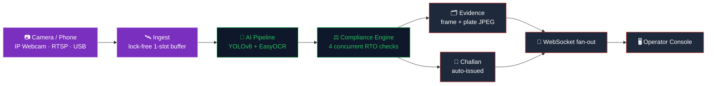

> 🔑 **Unknown plate? Not a dead end.** A valid Indian plate absent from the registry triggers a
> **synthetic dossier** — a deterministic, region-aware AI record (Indian owner name, vehicle
> make/model, RTO city, status rolls). Same plate → same dossier across restarts.

---

## 🎯 Project Vision

**VAAHAN AI** is an end-to-end computer-vision platform that automates the entire vehicle enforcement
lifecycle — from CCTV ingest to legally-formatted digital challan — without human dispatch in the loop.

Traditional enforcement bottlenecks happen at the *human* layer: officers manually reading plates,
manually checking compliance, manually issuing fines. VAAHAN AI collapses that loop into a single
asynchronous pipeline: YOLOv8 detection → multi-engine OCR → RTO compliance verification → evidence
capture → notification dispatch.

The platform is built to **drop directly into existing government infrastructure** — VAHAN/SARATHI
integration is an interface, not a rewrite — and is hardened for the operational realities of public
surveillance: rotating JWTs, audit-logged everything, RBAC at every endpoint, and a recoverable session
machine that never deadlocks the operator console.

---

## 🚀 Capabilities

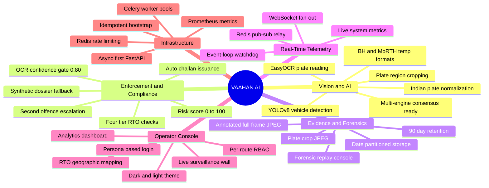

<details>
<summary><b>📋 Full feature breakdown</b> (every capability, expanded)</summary>

### 🚗 Vision & AI
- 🤖 **YOLOv8 vehicle detection** — COCO vehicle classes: **car, motorcycle, bus, truck**. *(Roadmap: custom-trained auto-rickshaw, tempo, trailer, tractor classes — these are not in the stock COCO model.)*
- ✂️ **Plate-region cropping** — dedicated plate model when present, else OpenCV Haar cascade, else a positional heuristic on the vehicle bbox.
- 🔤 **Multi-engine OCR architecture** — **EasyOCR active** in this build; **PaddleOCR + Tesseract are pluggable** as secondary/tertiary engines and engage automatically when primary confidence is low.
- 🌙 **Preprocessing pipeline** — contrast/deskew/binarize to maximize OCR signal on low-light and angled plates.
- ⚡ **GPU and CPU paths** — auto-selected via `GPU_ENABLED`. This build runs **CPU**.

### 💸 Enforcement & Compliance
- 🏛️ **Four-tier compliance engine** — registration, insurance, PUC, blacklist, evaluated concurrently.
- 🧠 **Synthetic dossier fallback** — when OCR reads a valid Indian plate not in the registry, the engine generates a deterministic, region-aware AI dossier (Indian owner name, vehicle make/model, RTO city, status rolls — INS 18% / PUC 22% / REG 9% / blacklist 2%). Same plate → same dossier across restarts.
- 🛡️ **OCR auto-challan safety gate** — challans auto-issue **only when `ocr_confidence ≥ 0.80`**. Borderline reads persist as Detections flagged "manual review required" instead.
- 📝 **Automated challan issuance** with INR fine calculation and PDF rendering.
- 📈 **Second-offence escalation** — repeat violators auto-trigger higher fines.
- 📡 **Twilio SMS + SMTP email** dispatch to owner-of-record.
- 🧾 **Audit trail** on every issuance, override, and payment status change.

### 🗂️ Evidence & Forensics
- 📸 **Annotated frame capture** — full surveillance frame with bbox overlays.
- 🔍 **Plate-crop JPEG** at capture resolution.
- 🛡️ **Date-partitioned storage** — `uploads/evidence/YYYY/MM/DD/<camera>/<uuid>_frame.jpg`.
- 🧹 **90-day retention** with auto-cleanup workers.
- 💻 **Forensic console** for case-by-case detection replay.

### 📡 Real-Time Telemetry
- ⚡ **WebSocket fan-out** via Redis pub/sub.
- 🎥 **Per-camera channels** plus global detection and alert streams.
- 📊 **Live system metrics** — CPU, RAM, GPU, queue depth, pipeline throughput.
- 🩺 **Event-loop watchdog** — a background task that measures loop lag every 5s and warns on stalls.

### 🖥️ Operator Console
- 🪪 **Persona-based login** — Operator / Command / Auditor cards, credentials auto-fill on selection.
- 🛡️ **Per-route RBAC** — `<RoleGuard capability=…>` wraps every `/dashboard/*` page; PII columns collapse server-side for viewer roles.
- 📺 **Live surveillance wall** — multi-camera tile view with detection overlays.
- 📉 **Analytics dashboard** — KPI cards, hourly timelines, violation breakdowns.
- 🗺️ **RTO geographic mapping** across active regional codes.
- 🌓 **Dark + light theme** via `next-themes` + CSS-variable tokens.

### ⚙️ Infrastructure
- 🐍 **Async-first FastAPI** — every endpoint `async def`; CPU-bound AI work is pushed to `asyncio.to_thread` so the event loop stays responsive.
- 🧵 **Celery worker pools** with dedicated queues (`ai`, `notifications`, `reports`).
- 🚦 **Redis sliding-window rate-limit** middleware.
- 📈 **Prometheus metrics** at `/metrics`.
- 🚀 **Idempotent bootstrap** — migrations + demo seeding on cold start.

</details>

### 🎭 Two demo modes, one platform

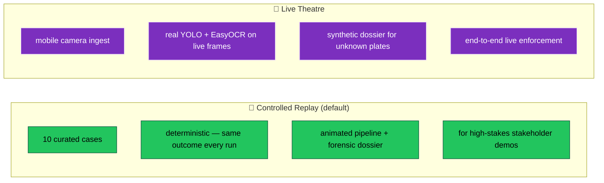

> 💡 **For a high-stakes live demo:** lead with **Controlled Replay** (deterministic), then flip to
> **Live Theatre** for the finale. Set `LIVE_ACTIVITY_ENABLED=false` first so the synthetic background
> feed doesn't mix fabricated detections into your real ones.

---

## 🖥️ Live Operator Console (UI mockup)

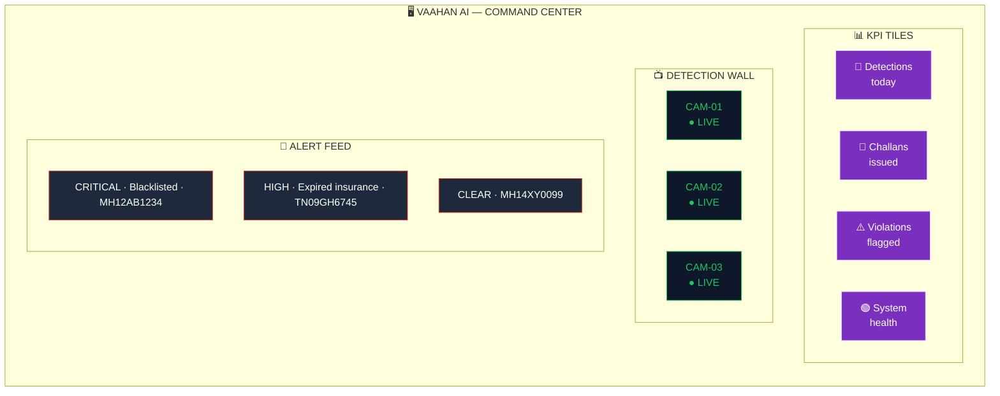

<details>
<summary><b>📸 Screen previews</b> (mockups in <code>docs/screenshots/</code>)</summary>

| Screen | What it shows |
| :--- | :--- |
| **Login — Persona-based access** | Operator / Command / Auditor cards; credentials auto-fill; audit-logged auth with rotating refresh tokens. `docs/screenshots/01-login.png` |
| **Command Center** | Live KPIs, hourly timeline, violation breakdowns, system health + threat-level indicator. `docs/screenshots/02-command-center.png` |
| **Surveillance Wall** | Per-camera tiles with detection overlays, plate confidence, per-stream latency. `docs/screenshots/03-surveillance-wall.png` |
| **Evidence Panel** | Annotated frame, plate crop, OCR confidence, compliance trace, downloadable bundle. `docs/screenshots/04-evidence-panel.png` |


</details>

---

## 🏗️ Architecture Deep Dive

### 🌐 System topology — edge ▸ proxy ▸ backend ▸ workers ▸ data

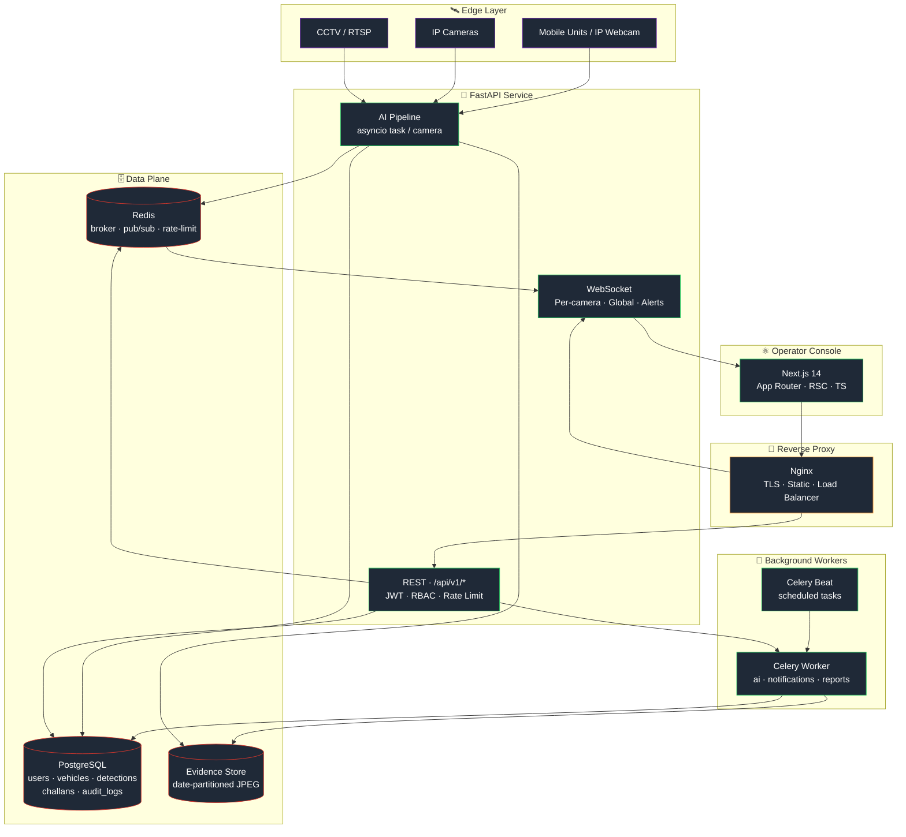

### 🧠 Backend module layout

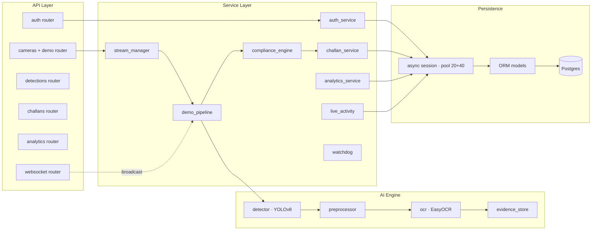

### ⚛️ Frontend architecture

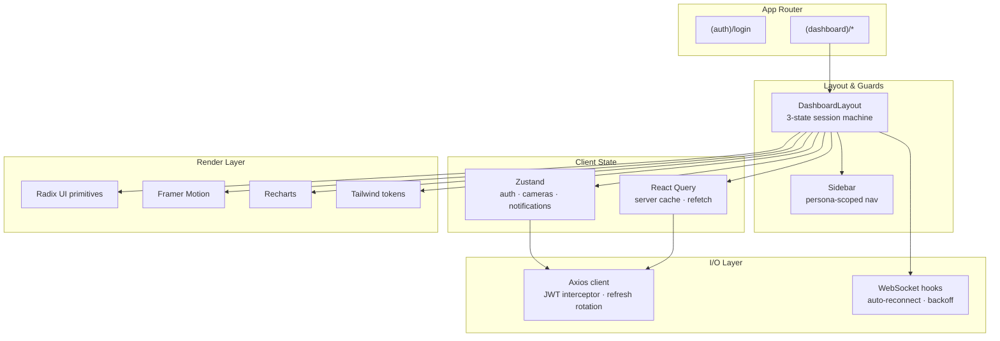

### 🔄 Session & auth state machine

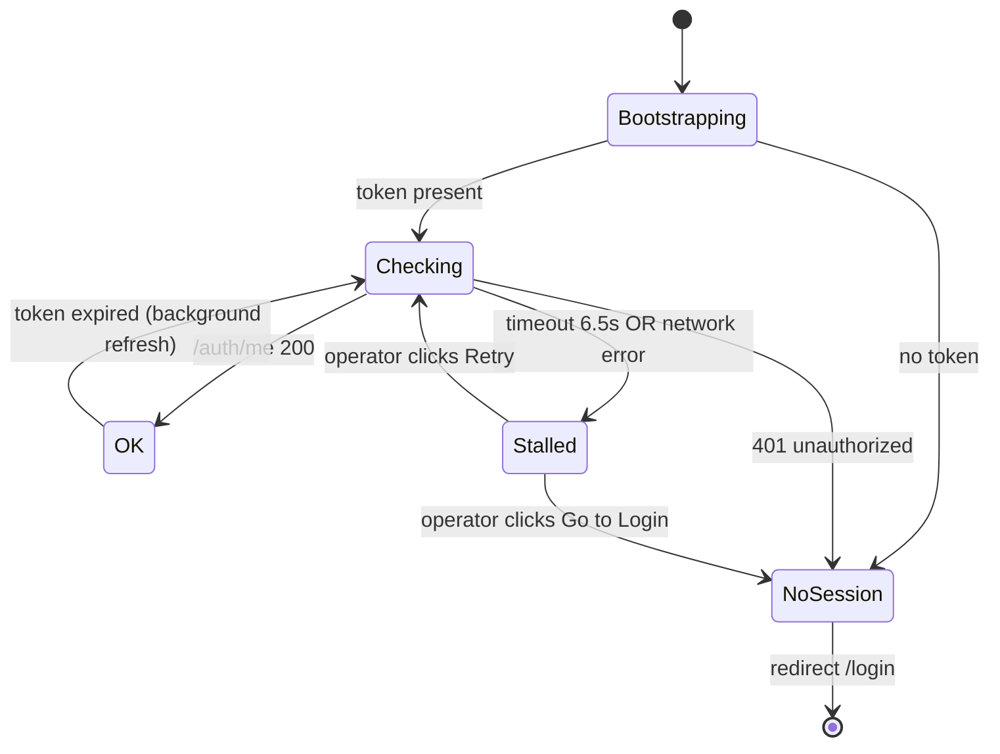

---

## 🧠 AI Pipeline — Exploded View

The per-camera pipeline runs as a single `asyncio` task. Every stage is non-blocking; CPU-bound work
runs in `asyncio.to_thread` so the event loop stays responsive.

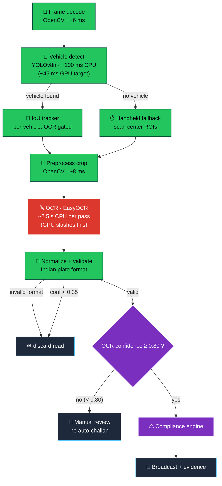

### ⏱️ Pipeline Latency & Budget (measured, CPU build — no GPU)

> 📐 **Honesty note:** numbers below are **measured on this CPU build**. There is **no GPU** here, so
> GPU figures are **targets**, not current behavior. The **live video preview** runs on a separate
> MJPEG passthrough at **~14 fps** — smooth video is independent of recognition latency.

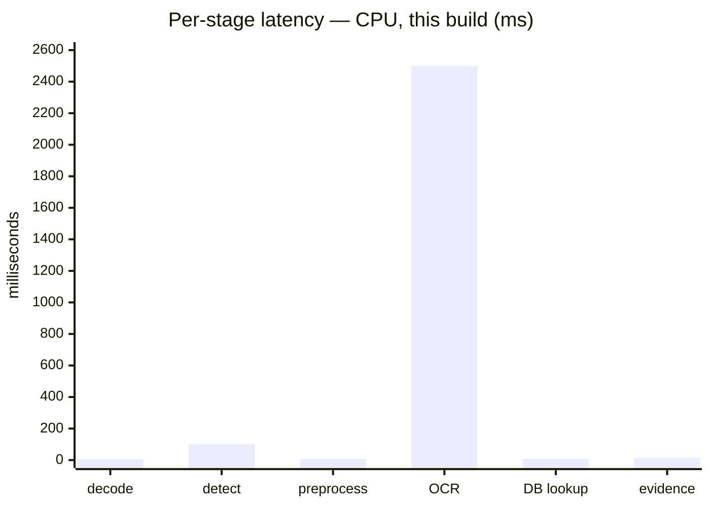

| Stage | Engine | Measured (CPU) |
| :--- | :--- | :---: |
| 📼 Frame decode | OpenCV | ~6 ms |
| 🚗 Vehicle detection | YOLOv8n | ~100 ms (P95 ~210 ms) |
| ✂️ Plate cropping | NumPy / Haar | ~2 ms |
| 🌙 Preprocessor | OpenCV | ~8 ms |
| 🔤 **OCR (EasyOCR)** | EasyOCR (beam-search) | **~2.5 s** ← cost center |
| 🗃 Vehicle lookup | PostgreSQL | ~8 ms |
| ✅ Compliance check | In-process | <2 ms |
| 🗂️ Evidence write | Disk (JPEG) | ~14 ms (async, off critical path) |
| 📡 Redis publish | Redis | <3 ms |
| ⚡ **End-to-end recognition** | | **~2.6 s (CPU, OCR-dominated)** |

> The **OCR bar towers over everything** — that's the honest cost center on CPU. A CUDA GPU is the
> single biggest lever to push end-to-end recognition toward sub-second.

### 🏁 Pipeline Latency Race — CPU vs GPU (detection stage)

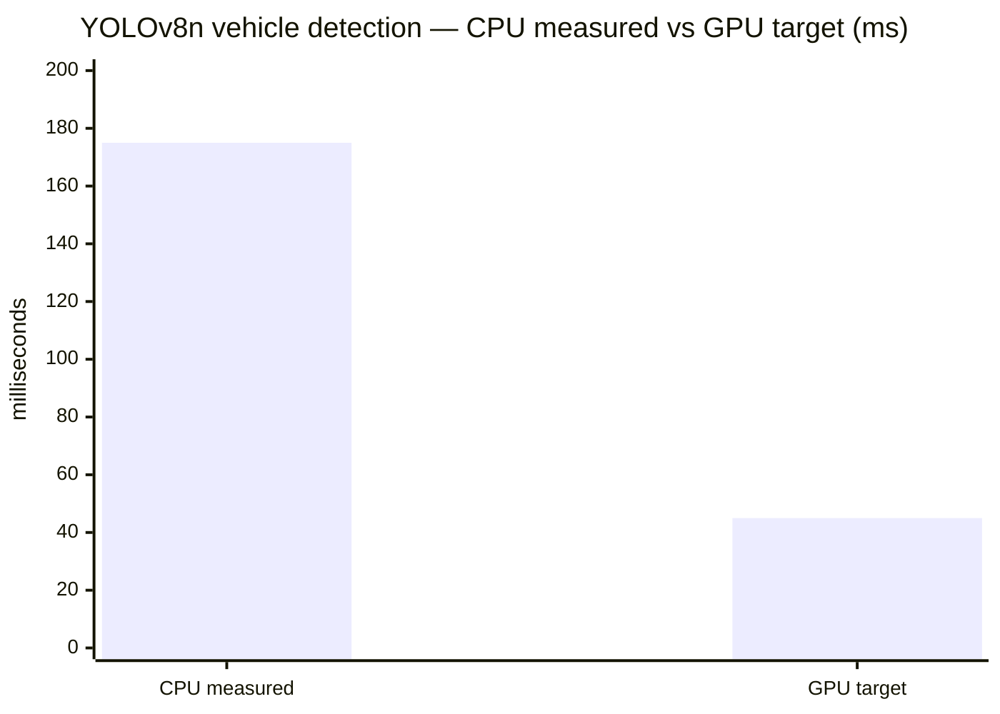

<sub>The classic "45 vs 175" holds for the **detection stage**. End-to-end on CPU is dominated by OCR
(above); GPU is required to hit sub-second end-to-end.</sub>

> ⚠️ **Don't break the API:** if you crank thresholds without understanding the pipeline, you'll either
> miss violations or issue challans to innocent scooters minding their business. Tuning is power — use
> it responsibly.

---

## ⚖️ The Compliance Engine

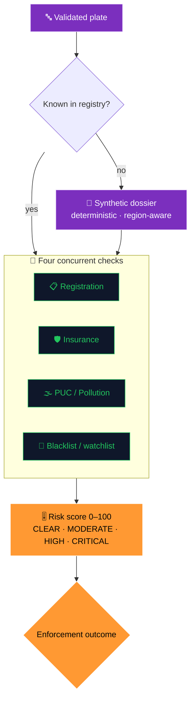

### 🚓 Enforcement Decision Tree — detection ▸ challan ▸ escalation

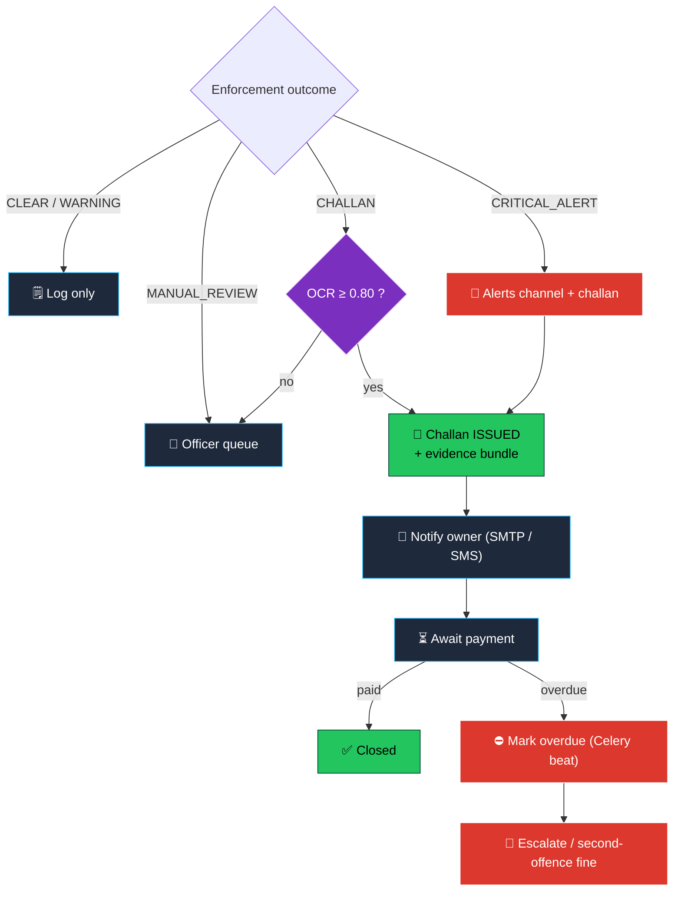

---

## 🔐 Security Fortress

### JWT refresh flow (HS256 · access 30 min · refresh 7 d · rotated on use)

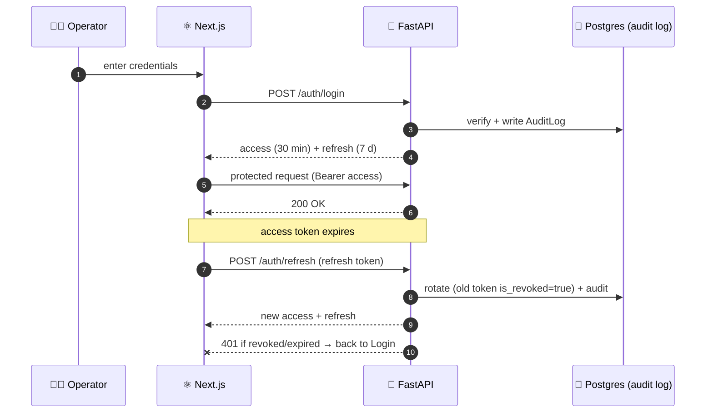

### Rate-limit sliding window + audit

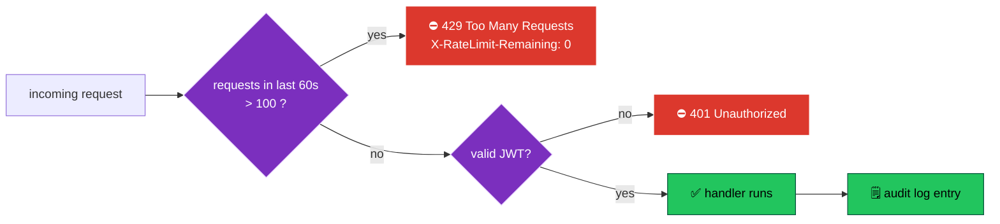

<details>
<summary><b>🛡️ Full security feature matrix</b></summary>

| Feature | Implementation |
| :--- | :--- |
| 🔑 **JWT access + refresh** | Short-lived (**30 min**) access + long-lived (**7 day**) refresh, stored separately. Refresh tokens persisted server-side and **rotated on every use** (old token `is_revoked=true`). |
| 🧂 **bcrypt password hashing** | Cost factor 12, 72-byte input truncation handled explicitly so malformed inputs never crash auth. |
| 🚪 **Account lockout** | Configurable threshold (default 5 failed attempts → 15-min lock). Failed attempts + lock events audit-logged with source IP. |
| 🛡️ **Role-based access control** | `superadmin · admin · operator · viewer` enforced via FastAPI dependencies (`require_admin`, `require_operator`, …). |
| 📝 **Audit log** | Every login, logout, challan issuance, role change, override recorded in `audit_logs` with user ID, IP, user-agent, success flag. |
| 🚦 **Rate limiting** | Redis-backed sliding-window limiter (**100 req / 60 s** per IP). Bypasses `/health` and `/metrics`. |
| 🧷 **CORS allow-list** | Strict; defaults to `localhost:3000`. (Dev mode permits arbitrary LAN origins for phone testing.) |
| 🔐 **Token-gated WebSockets** | Every WS connection re-validates the JWT before subscribing to channels. |
| 🔄 **Recoverable session machine** | Frontend enforces a 6.5-second hard timeout on `/auth/me` with `AbortController`; falls into a `StalledScreen` with explicit Retry / Go-to-login. Sessions never deadlock. |
| 🩺 **Liveness vs readiness** | `/health/live` is a zero-I/O probe; `/health` runs DB + Redis checks under a 1.5 s timeout so a hung dependency can never make health hang. |

> 🔒 **Production checklist:** enable TLS at Nginx, set strong secrets (min 32 chars), keep `DB_ECHO=false`, and treat the evidence store like a legal artifact — because it is.

</details>

---

## 🚀 One-Command Bootstrap

```bash
git clone https://github.com/your-org/vaahan-ai
cd vaahan-ai
./start.sh
```

```
  VAAHAN AI — bringing the platform online
  ────────────────────────────────────────────────────────
  [OK]  Docker is running
  [OK]  .env created with auto-generated secure keys
  [-->] Building images ............................ ▓▓▓▓▓▓▓▓▓▓ 100%
  [-->] Postgres ............ healthy  ▓▓▓▓▓▓▓▓▓▓
  [-->] Redis ............... healthy  ▓▓▓▓▓▓▓▓▓▓
  [-->] FastAPI ............. healthy  ▓▓▓▓▓▓▓▓▓▓
  [-->] Celery worker/beat .. up       ▓▓▓▓▓▓▓▓▓▓
  [-->] Next.js + Nginx ..... up       ▓▓▓▓▓▓▓▓▓▓
  [OK]  Alembic migrations applied
  [OK]  Demo users + cameras + detections seeded
  ────────────────────────────────────────────────────────
  Open  →  http://localhost
```

**`start.sh` does:** ① generate `.env` with secure JWT/DB secrets · ② build images · ③ bring up
Postgres, Redis, FastAPI, Celery worker, Celery beat, Flower, Next.js, Nginx · ④ wait for health ·
⑤ apply Alembic migrations · ⑥ seed demo users + cameras + detections · ⑦ print access URL.

**Flags:** &nbsp; `./start.sh` (start) &nbsp;·&nbsp; `--fresh` (wipe volumes + reseed) &nbsp;·&nbsp; `--stop` &nbsp;·&nbsp; `--status`

<details>
<summary><b>🧰 Manual setup, verification & demo credentials</b></summary>

```bash
# Prerequisites: Docker Desktop 24+ (26+ rec.) · 4 GB RAM (8 GB rec.) · 6 GB disk (20 GB rec.)
#                macOS / Linux / WSL2 · GPU optional (NVIDIA + CUDA 12)

# Manual bring-up (no start.sh)
cp .env.example .env
docker compose build
docker compose up -d
docker exec enforcement-backend python -m scripts.bootstrap

# Verify
curl http://localhost:8000/health                                  # all subsystems green
docker exec enforcement-backend python scripts/validate_pipeline.py # 22-check validation suite
docker exec enforcement-backend python -m scripts.reset_demo_auth   # demo auth round-trip
```

**Demo personas** (auto-fill on the login screen):

```
admin@enforcement.gov     · Admin@1234   · superadmin
operator@enforcement.gov  · Admin@1234   · operator
viewer@enforcement.gov    · Admin@1234   · viewer
```

**Ports:** Nginx `80/443` · FastAPI `8000` · Next.js `3000` · Flower `5555` · Postgres `5432` · Redis `6379`.

</details>

### 🔁 Developer Experience — a day in the life

```mermaid
gantt
    title Typical dev loop
    dateFormat HH:mm
    axisFormat %H:%M
    section Boot
    ./start.sh                :a1, 09:00, 4m
    wait for health           :a2, after a1, 2m
    section Work
    tail backend logs         :b1, after a2, 30m
    edit + docker restart be  :b2, after b1, 20m
    connect phone / test      :b3, after b2, 25m
    section Wrap
    run validate_pipeline.py  :c1, after b3, 5m
    docker compose down       :c2, after c1, 1m
```

> 💡 `uvicorn --reload` is unreliable here (it reloads the heavy AI models). After backend `.py` edits,
> prefer `docker restart enforcement-backend`.

---

## 🎥 Demo Workflow — how a live detection unfolds

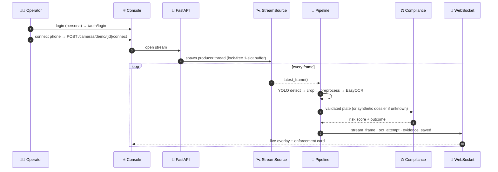

<details>
<summary><b>📜 Full 15-step narrative</b></summary>

1. 👤 **Operator logs in**, selects a persona card → `POST /api/v1/auth/login`. Backend issues access + refresh JWTs, persists the refresh token, writes an `AuditLog` row.
2. 🎥 **Operator starts a stream** → `POST /api/v1/cameras/{id}/start` (or `/cameras/demo/{id}/connect` for mobile). `stream_manager` boots a per-camera worker.
3. 📼 **Frames flow in** via the lock-free 1-slot buffer — the consumer always grabs the newest frame, never a backlog.
4. 🚗 **YOLOv8 detects vehicles** (`conf ≥ 0.5`). If no vehicle is found, the **handheld fallback** OCRs center ROIs (hold a plate to the camera).
5. 🌙 **Preprocessor** boosts contrast / deskews / binarizes the plate crop.
6. 🔤 **EasyOCR** reads the plate; reads below `0.35` confidence or invalid Indian format are discarded.
7. 🗃️ **Vehicle lookup** against the registry; **unknown valid plates get a synthetic dossier**.
8. ✅ **Compliance engine** checks registration, insurance, PUC, and blacklist concurrently → risk score + outcome.
9. 🟢 **If clean**, a `Detection` row is inserted (`is_violation=false`).
10. 🔴 **If challan-worthy AND `ocr_confidence ≥ 0.80`**, `challan_service` issues a challan with INR fine (second-offence escalation applies).
11. 🗂️ **Evidence saved** — annotated frame + plate crop — to `uploads/evidence/YYYY/MM/DD/<camera>/`.
12. 📡 **Redis publish** broadcasts to `global:detections`, `demo:{id}`, and (for violations) `global:alerts`.
13. 🌐 **WebSocket fan-out** delivers to every connected operator console.
14. 📲 **Celery worker** dispatches SMS (Twilio) + email (SMTP) from the `notifications` queue.
15. 📺 **Operator sees the event** in the live feed + surveillance wall, one click from the evidence panel.

</details>

---

## 📡 Real-time Telemetry

### Frame → Redis pub/sub → operator screen

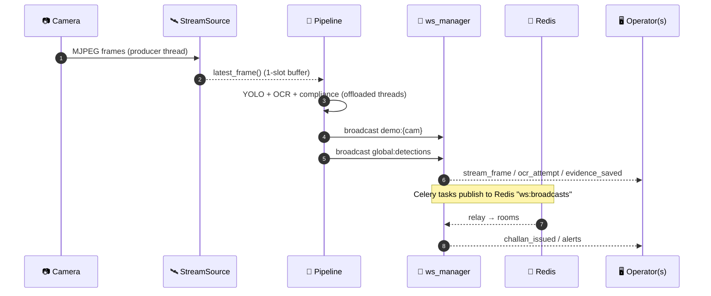

<details>
<summary><b>🧵 Channels & event payloads</b></summary>

All WebSocket endpoints require a JWT via `?token=<access_token>`.

| Endpoint | Scope | Use case |
| :--- | :--- | :--- |
| `ws://host/ws/detections` | all detections | global activity feed |
| `ws://host/ws/camera/{id}` | single camera | surveillance-wall tile |
| `ws://host/ws/alerts` | violations + challans | operator alert pane |
| `ws://host/ws/metrics` | system metrics (5 s tick) | system health page |
| `ws://host/api/v1/cameras/demo/{id}/stream` | live demo | per-frame overlay events |

**`detection_event`** — emitted on every persisted detection
```json
{
  "type": "detection",
  "id": "ce0f4e83-14ad-4222-ba86-c388f4d8ecca",
  "camera_id": "5b0194fc-8e1f-4496-9632-94caa2c8311f",
  "camera_code": "MUM-BWS-02",
  "plate": "MH01BU2433",
  "ocr_confidence": 0.91,
  "vehicle_confidence": 0.80,
  "is_violation": true,
  "violation_type": "Expired Insurance",
  "processing_time_ms": 143,
  "bounding_box": { "x1": 713, "y1": 220, "x2": 1415, "y2": 634 },
  "frame_width": 1920,
  "frame_height": 1080,
  "timestamp": "2026-05-25T21:20:25Z"
}
```

**`alert_event`** — emitted on violations and challan issuance
```json
{
  "type": "alert",
  "severity": "high",
  "detection_id": "ce0f4e83-...",
  "challan_id": "8c2f4...",
  "plate": "MH01BU2433",
  "violation_type": "Expired Insurance",
  "fine_amount_inr": 1500,
  "second_offence": false
}
```

**`system_metrics`** — emitted every 5 seconds
```json
{
  "type": "system_metrics",
  "cpu": 34.2,
  "memory": 51.7,
  "active_connections": 7,
  "active_cameras": 3,
  "gpu": { "available": false }
}
```

</details>

---

## 🛰️ API — Postman-style Collection

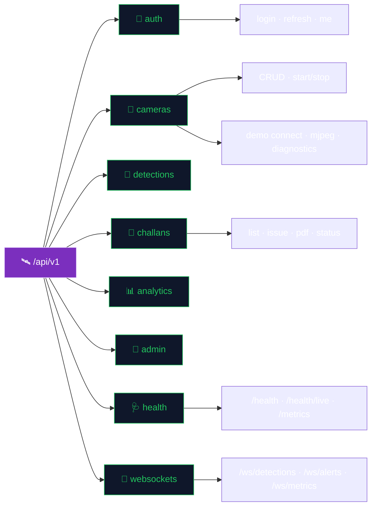

Interactive OpenAPI 3.1 docs are auto-served at **`http://localhost:8000/docs`** *(disabled in production)*.

<details>
<summary><b>📖 Full endpoint reference</b></summary>

```http
# ── Auth ────────────────────────────────────────────────────────────
POST   /api/v1/auth/login              issue access + refresh tokens
POST   /api/v1/auth/refresh            rotate refresh, issue new access
GET    /api/v1/auth/me                 current user from bearer token
POST   /api/v1/auth/register           create user (admin-only in prod)

# ── Cameras ─────────────────────────────────────────────────────────
GET    /api/v1/cameras                  list (paginated)
POST   /api/v1/cameras                  register a camera
GET    /api/v1/cameras/{id}             detail
PATCH  /api/v1/cameras/{id}             update
POST   /api/v1/cameras/{id}/start       start AI pipeline
POST   /api/v1/cameras/{id}/stop        stop AI pipeline
GET    /api/v1/cameras/status/active    active stream ids

# ── Live demo (mobile camera ingest) ────────────────────────────────
POST   /api/v1/cameras/demo/probe                 test reachability + kind
POST   /api/v1/cameras/demo/{id}/connect          open stream + start ANPR
POST   /api/v1/cameras/demo/{id}/disconnect       graceful teardown
GET    /api/v1/cameras/demo/{id}/status           running + metrics
GET    /api/v1/cameras/demo/{id}/diagnostics      full pipeline state
GET    /api/v1/cameras/demo/{id}/mjpeg?token=...  multipart MJPEG passthrough
WS     /api/v1/cameras/demo/{id}/stream?token=... structured events

# ── Detections ──────────────────────────────────────────────────────
GET    /api/v1/detections              history (filter violations_only)
GET    /api/v1/detections/recent       most recent N events
GET    /api/v1/detections/stats        24h aggregate counts

# ── Challans ────────────────────────────────────────────────────────
GET    /api/v1/challans                list (filter by status)
GET    /api/v1/challans/{id}           detail
POST   /api/v1/challans                issue manually
PATCH  /api/v1/challans/{id}/status    mark paid / disputed / cancelled
GET    /api/v1/challans/{id}/pdf       download challan PDF
GET    /api/v1/challans/stats          issuance & payment stats

# ── Analytics ───────────────────────────────────────────────────────
GET    /api/v1/analytics/dashboard     KPI summary
GET    /api/v1/analytics/timeline      hourly detection counts
GET    /api/v1/analytics/system        CPU · RAM · GPU · queue depth
GET    /api/v1/analytics/cameras       per-camera throughput
GET    /api/v1/analytics/violations    violation-type distribution
GET    /api/v1/analytics/ai-performance OCR + detection accuracy

# ── Admin ───────────────────────────────────────────────────────────
GET    /api/v1/admin/users             list users
PATCH  /api/v1/admin/users/{id}/role   change role
PATCH  /api/v1/admin/users/{id}/active enable/disable account
GET    /api/v1/admin/audit-logs        audit-log search

# ── Health & observability ──────────────────────────────────────────
GET    /health                         readiness (DB + Redis, timeout-bounded)
GET    /health/live                    liveness (zero-IO)
GET    /metrics                        Prometheus exposition
```

</details>

---

## ⚙️ Environment Variables

All settings are validated by Pydantic in `backend/app/core/config.py`. The platform refuses to boot
with invalid configuration.

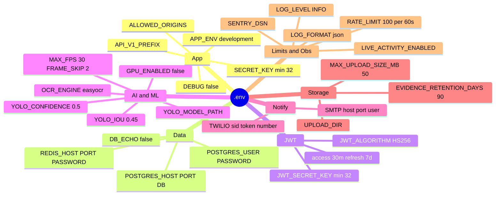

<details>
<summary><b>📑 Full variable reference</b> (defaults from <code>config.py</code>)</summary>

### Application
| Variable | Default | Description |
| :--- | :--- | :--- |
| `APP_NAME` | `AI Enforcement Platform` | Display name in logs / OpenAPI |
| `APP_ENV` | `development` | `production` disables `/docs`, demo seeding, synthetic generators |
| `APP_VERSION` | `1.0.0` | Surfaced via `/health` |
| `DEBUG` | `false` | Verbose tracebacks, token-less WS in dev |
| `SECRET_KEY` | — | App-wide secret, **min 32 chars** |
| `API_V1_PREFIX` | `/api/v1` | Versioned API mount point |
| `ALLOWED_ORIGINS` | `http://localhost:3000` | Comma-separated CORS allow-list |

### Database & Cache
| Variable | Default | Description |
| :--- | :--- | :--- |
| `POSTGRES_HOST` | `localhost` | `postgres` inside Docker network |
| `POSTGRES_PORT` | `5432` | |
| `POSTGRES_DB` | `enforcement_db` | |
| `POSTGRES_USER` | `enforcement_user` | |
| `POSTGRES_PASSWORD` | — | Min 8 chars |
| `REDIS_HOST` / `REDIS_PORT` | `localhost` / `6379` | |
| `REDIS_PASSWORD` | — | Optional; recommended in prod |
| `DB_ECHO` | `false` | **Keep false** — SQL echo on the event-loop thread can soft-lock the system under load |

### Authentication
| Variable | Default | Description |
| :--- | :--- | :--- |
| `JWT_SECRET_KEY` | — | Min 32 chars; rotate to invalidate all sessions |
| `JWT_ALGORITHM` | `HS256` | |
| `JWT_ACCESS_TOKEN_EXPIRE_MINUTES` | `30` | Access-token lifetime |
| `JWT_REFRESH_TOKEN_EXPIRE_DAYS` | `7` | Refresh-token lifetime |

### AI / ML
| Variable | Default | Description |
| :--- | :--- | :--- |
| `YOLO_MODEL_PATH` | `/app/ai/models/yolov8n.pt` | Bundled / auto-downloaded |
| `YOLO_CONFIDENCE_THRESHOLD` | `0.5` | Min vehicle-detection confidence |
| `YOLO_IOU_THRESHOLD` | `0.45` | NMS IoU cutoff |
| `OCR_ENGINE` | `easyocr` | `easyocr` · `paddleocr` · `both` · `all` |
| `GPU_ENABLED` | `false` | Set `true` for CUDA |
| `MAX_FPS` / `FRAME_SKIP` / `AI_WORKERS` | `30` / `2` / `2` | Throughput tuning |

### Notifications · Storage · Limits · Observability
| Variable | Default | Description |
| :--- | :--- | :--- |
| `SMTP_HOST` / `SMTP_PORT` | `smtp.gmail.com` / `587` | Blank `SMTP_USER` disables email |
| `TWILIO_ACCOUNT_SID` / `TWILIO_AUTH_TOKEN` / `TWILIO_PHONE_NUMBER` | — | Blank disables SMS |
| `UPLOAD_DIR` | `/app/uploads` | Evidence root |
| `MAX_UPLOAD_SIZE_MB` | `50` | Request body cap |
| `EVIDENCE_RETENTION_DAYS` | `90` | Auto-cleanup window |
| `RATE_LIMIT_REQUESTS` / `RATE_LIMIT_WINDOW` | `100` / `60` | Per-IP sliding window |
| `LIVE_ACTIVITY_ENABLED` | *(dev: on)* | **Set `false` for live demos** — disables the synthetic detection generator |
| `LOG_LEVEL` / `LOG_FORMAT` | `INFO` / `json` | |
| `SENTRY_DSN` | — | Optional |

### Frontend (`NEXT_PUBLIC_*`)
| Variable | Default | Description |
| :--- | :--- | :--- |
| `NEXT_PUBLIC_API_URL` | `http://localhost:8000` | Backend base URL |
| `NEXT_PUBLIC_WS_URL` | `ws://localhost:8000` | WebSocket base URL |
| `NEXT_PUBLIC_APP_NAME` | `VAAHAN AI` | Branding |

</details>

---

## 🏛️ Future Government Integration

```mermaid
flowchart LR
    CORE["⚖️ VAAHAN Compliance Engine"] --> ADAPTER["🔌 VahanAdapter<br/>(interface)"]
    ADAPTER -. "plug-and-play" .-> VAHAN["🏛️ VAHAN<br/>vehicle registry"]
    ADAPTER -. "plug-and-play" .-> SARATHI["🪪 SARATHI<br/>driving licence"]
    ADAPTER -. "compatible" .-> ECHALLAN["🧾 eChallan<br/>MoRTH citation format"]

    classDef core fill:#7B2FBE,stroke:#E9D5FF,color:#fff;
    classDef adapter fill:#22C55E,stroke:#064E3B,color:#000;
    classDef gov fill:#FF9933,stroke:#fff,color:#000;
    class CORE core;
    class ADAPTER adapter;
    class VAHAN,SARATHI,ECHALLAN gov;
```

The integration surface is intentionally narrow — a handful of well-defined interfaces — so a state RTO
can adopt it without re-architecting their backend.

<details>
<summary><b>🔌 VahanAdapter · SARATHI · eChallan details</b></summary>

**VAHAN registry.** The `vehicles` table mirrors the VAHAN schema (plate, category, owner, registration
date, expiry, insurance, PUC, blacklist). A `VahanAdapter` is the only swap needed:

```python
class VahanAdapter(Protocol):
    async def lookup_plate(self, plate: str) -> VahanVehicle: ...
    async def fetch_expiry(self, plate: str) -> ExpiryRecord: ...
    async def check_blacklist(self, plate: str) -> bool: ...
```

A production deployment replaces the in-database lookup with a `VahanAdapter` hitting the live VAHAN
API, with the local DB acting as a write-through cache.

**SARATHI.** For driver-attributed violations, the `OwnerLookup` service can pivot from plate-owner to
last-known-driver via SARATHI cross-reference once licence-plate-to-driver mapping is authorised.

**eChallan.** The challan format follows the **Ministry of Road Transport & Highways** spec: unique
challan ID (UUIDv4 + state-code prefix), vehicle + owner block, MV-Act-mapped violation classification,
jurisdictional fine schedule, evidence reference, and a QR code to the payment portal. Pointing the QR
at the state's official portal is a one-line config change.

</details>

---

## 🗺️ Roadmap

```mermaid
timeline
    title VAAHAN AI — the road ahead
    Q2 2026 : Hardened live ingest : Controlled-replay demo mode
    Q3 2026 : VAHAN live API : SARATHI licence lookups
    Q4 2026 : ANPR heatmaps : multi-city federation
    Q1 2027 : GPU inference tier : custom vehicle classes : edge deployment
```

---

## 🗣️ Testimonial

> *"I asked it about a scooter with no papers. Before I finished my chai, it had the owner, the expired
> insurance, and a challan with photo evidence. My filing cabinet has trust issues now."*
> — **Inspector R. Kulkarni**, RTO (fictional, but he speaks for the cabinet) 🧾

---

## 😂 Meme Corner

```
   WHEN THE PLATE ISN'T IN THE DATABASE
   ┌───────────────────────────────────┐
   │   other systems:  ¯\_(ツ)_/¯  404   │
   │   VAAHAN AI:    "generating dossier"│
   │                  🧬  *believable*   │
   └───────────────────────────────────┘

   me: "it's just connecting a phone to a laptop"
   the phone: connects for 1 second
   the laptop:  ▄︻デ  reopen storm  ╦══━一
   ...one if-statement later...   (╯°□°)╯  STABLE

   WHEN YOU SET OCR CONFIDENCE TO 0.15
   "wait... who is MH-XX-LOL-420 and why do they owe ₹2000?"
```

---

## ⭐ Star History (placeholder)

<div align="center">

[](#)

</div>

---

## 👥 Contributors

<div align="center">
<table>
  <tr>
    <td align="center"><b>🧠</b><br/>Core Pipeline</td>
    <td align="center"><b>⚛️</b><br/>Operator Console</td>
    <td align="center"><b>⚖️</b><br/>Compliance Engine</td>
    <td align="center"><b>🛡️</b><br/>Security &amp; Infra</td>
  </tr>
</table>

<sub>Built with FastAPI · Next.js 14 · PostgreSQL · Redis · Celery · OpenCV · YOLOv8 · EasyOCR · WebSockets · Docker</sub>

<br/>

**VAAHAN AI** — *Built with real models, real pipelines, real audit trails.*

### ⚡ No mocks. No placeholders. No "trust me bro." ⚡

</div>
